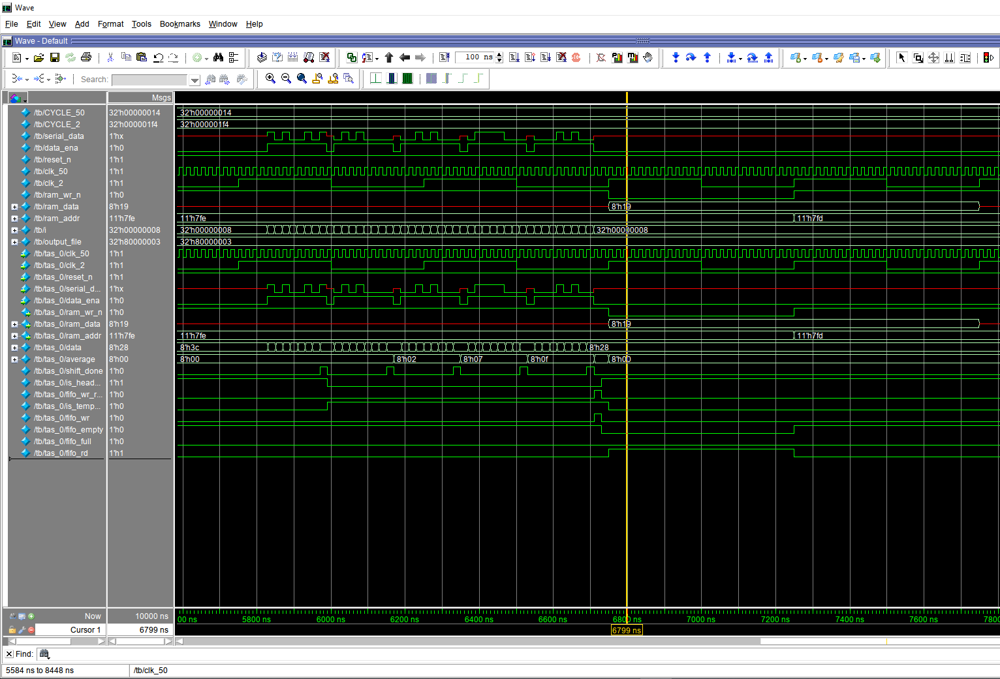

# ECE 474 Homework 6
## Temperature Averager System(tas)

[RTL_src](../hw6_satelliteReciever_tas/rtl_src/tas.sv)
<<<<<<< HEAD

[testbench](../hw6_satelliteReciever_tas/rtl_src/tb.sv)




=======
  
[testbench](../hw6_satelliteReciever_tas/rtl_src/tb.sv)
  

<!-- 
 -->
>>>>>>> origin/master
## Background

NASA has launched a space probe that is to orbit the moon of a planet in our solar system.
This probe, among its other duties, is to report back to earth at 5 to 15 minute intervals the
temperature at the surface of the moon.


## Operation:

The space probe records four temperature readings per hour. When the probe is in contin-
uous radio contact with tracking stations, a header of either 0xA5 or 0xC3 will be sent fol-
lowed by four temperature readings, sent no closer than every 5 minutes apart and no
further than 15 minutes apart. The temperature averaging system (tas) averages the four
readings and writes the result to RAM.
As the probe orbits the moon it will periodically loose contact with earth for up to one
hour. (i.e. 1 orbit every 2hrs) During these times, the probe queues the temperature read-
ings until contact is reestablished. Therefore, sometimes partial packets will be received
consisting of only a header or a header plus one to three temperature readings. In this case,
the packet bytes remain in order and the remaining bytes are sent upon reestablishing con-
tact.
In the case where there are readings queued in the probe and at the moment of radio con-
tact establishment, another temperature reading must be sent, the probe will delay sending
the new reading for one second after the old readings are sent.

## Requirements:

A digital system is required to capture the temperature information sent from the probe
and write the hourly average temperatures into a two-port static RAM (2K x 8) where fur-
ther processing will take place with the aid of a microcomputer.
The interface of the tas to the outside world is as follows:

## Top Level Interface
```
module tas (
       input  clk_50,               // 50Mhz input clock
       input  clk_2,                // 2Mhz input clock
       input  reset_n,              // reset async active low
       input  serial_data,          // serial input data
       input  data_ena,             // serial data enable
       output ram_wr_n,             // write strobe to ram
       output [7:0] ram_data,       // ram data
       output [10:0] ram_addr       // ram address
       );
```

## Message Protocol:

All data from the probe is sent within a five byte packet. Each packet is preceeded with a
header indicating the data type. Four data bytes follow. The header indicating temperature
data will be either 0xA5 or 0xC3. Data packets other than temperature data is to be
rejected.

## Data Format:

The temperature information in the data fields is in binary format. It will range in value
from 0 to 127 to indicate temperature in degrees.

## Input:

Data from the probe is sent clock synchronous at a 50Mhz rate. The 50 MHz clock from
external logic is free running (i.e. never stops).
The reset signal reset_n is asserted early before any clock or enable signals begin to assert.
It should be used to reset all your logic.
Bits within a byte are sent consecutively. Consecutive bytes (header or data) are separated
by one at least one 50Mhz clock cycle.

## Output Data Format:

The data written to RAM consists of subsequent averaged temperatures written to RAM
starting at address 0x07FF. Subsequent averages are written to the next lower address
location; 0x07FE, 0x07FD, etc.When location 0x0000 is written, the next write is to loca-
tion 0x07FF.
Header bytes are not to be stored in RAM.

## RAM Timing:

The averaged temperature data is to be written into an asynchronous static RAM. This
RAM is configured as 2K by 8 bits. The system described here needs only control the
address, data and a write strobe. The write strobe signal ram_wr_n must be guaranteed to
be glitch free and should be asserted for the minimum time allowed by the system.

## Miscellaneous Requirements:

The temperature averaging system is to operate at a clock frequency of 2Mhz where possi-
ble.
The maximum number of gates is 1000.
