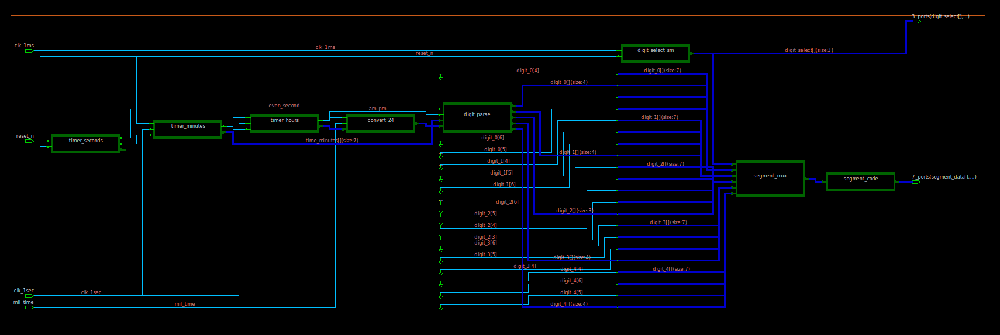

# ECE 474 Homework 7
## Digital Clock

[RTL_src](../hw7_digitalclock_clock/rtl_src/tas.sv)

[testbench](../hw7_digitalclock_clock/rtl_src/tb.sv)




## Introduction:

In this homework, we will write verilog code for digital clock.

## Top Level Interface
```
module clock(
    input             reset_n,             //reset pin
    input             clk_1sec,            //1 sec clock
    input             clk_1ms,             //1 mili sec clock
    input             mil_time,            //mil time pin
    output reg [6:0]  segment_data,        // output 7 segment data
    output reg [2:0]  digit_select         // digit select
    );
```

## Requirments

2) Simulate clock behaviour using dofile.

What to turn in:
  Tar file of your code. It should have a shell script which simulates
  the clock

Grading
  -Correct operation of clock                   -90%
  -Code cleanliness, coding efficiency, style   -10%
